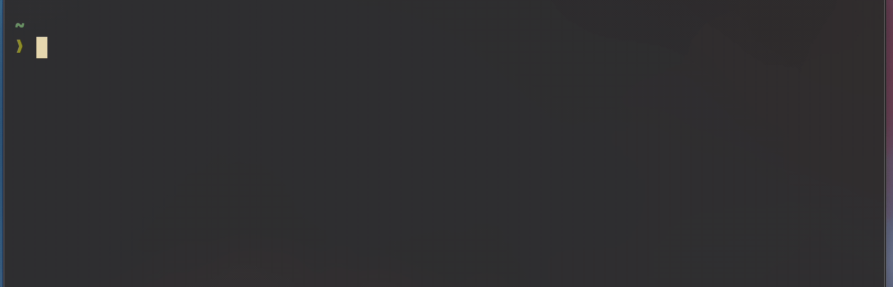
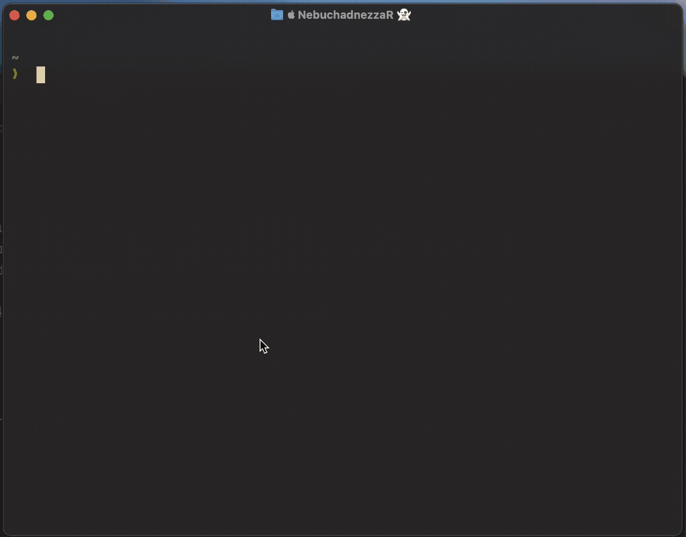

> **Update, August 2026:** I dropped oh-my-zsh since I first wrote this. I've revised
> the post to match what I actually run now: plain zsh, two plugins, and a few tools
> around them.

The terminal is hard to avoid these days, and if you're in one all day it's worth a
bit of effort to make it fast. Wherever possible, I like to keep my tooling simple and
effective so I can focus on the task at hand.

My shell of choice is ZSH. I ran it with oh-my-zsh for years and it was fine, until
startup got slow enough that I noticed it every time I opened a terminal. It also
bothered me that I couldn't tell you which behaviour came from the framework and which
came from zsh itself. I was loading a lot to get a handful of things I actually used,
so I pulled it out and built the small part back by hand.

I am aware there are many other shells and plugins and would really like to try something
like Fish, but I'm too busy with other priorities right now. With that out the way,
here's what I run and what it took to replace the framework.

## Life without a framework

There's no plugin manager, so a plugin is just a file you source. I keep mine in
`~/.zsh/plugins` and clone them with git:

```bash
git clone https://github.com/Aloxaf/fzf-tab ~/.zsh/plugins/fzf-tab
git clone https://github.com/zsh-users/zsh-syntax-highlighting ~/.zsh/plugins/zsh-syntax-highlighting
```

Then two lines in `.zshrc`:

```zsh
source ~/.zsh/plugins/fzf-tab/fzf-tab.plugin.zsh
source ~/.zsh/plugins/zsh-syntax-highlighting/zsh-syntax-highlighting.zsh
```

To update one, `git pull` in its directory. That's the whole plugin system.

The framework was also doing completion and history for me, so those needed replacing.
Completion first:

```zsh
autoload -Uz compinit
if [[ -n ~/.zcompdump(#qN.mh+24) ]]; then
  compinit
else
  compinit -C
fi

zstyle ':completion:*' matcher-list 'm:{a-z}={A-Z}' # case-insensitive matching
zstyle ':completion:*' menu no                      # let fzf-tab handle the menu
zstyle ':completion:*' special-dirs true            # complete . and ..
zstyle ':completion:*' list-colors "${(s.:.)LS_COLORS}"
```

Rebuilding the completion cache is the slow part of starting a shell. That glob pattern
asks whether `~/.zcompdump` was touched more than 24 hours ago — if it was, do the full
`compinit`, otherwise use `compinit -C` and trust the cache. You pay for the rebuild
once a day instead of on every new terminal.

The `zstyle` lines are small comforts. Case-insensitive matching means `cd dow` finds
`Downloads`, and `special-dirs` completes `.` and `..` so you can tab through
`../../` instead of typing it. `menu no` is the odd one out: it tells zsh not to draw
its own completion menu, which is what fzf-tab asks for so it can fill in the shared
prefix before it opens the picker.

Then history:

```zsh
HISTFILE="$HOME/.zsh_history"
HISTSIZE=50000
SAVEHIST=50000
setopt extended_history
setopt hist_expire_dups_first
setopt hist_ignore_dups
setopt hist_ignore_space
setopt share_history
```

`hist_ignore_space` is the one worth knowing: start a command with a space and it never
reaches your history file, which is handy when there's a token on the line.
`share_history` means a command run in one terminal shows up in the others.

That's roughly 25 lines to replace the framework.

## Git aliases

The git plugin was the bit of oh-my-zsh I used most. It gave you short aliases like
`gst` for `git status` and `gaa` for `git add --all`. Rather than pull it in on its own,
I moved what I actually used into `~/.gitconfig`:

```ini
[alias]
	lg = log --color --graph --pretty=format:'%Cred%h%Creset -%C(yellow)%d%Creset %s %Cgreen(%cr) %C(bold blue)<%an>%Creset' --abbrev-commit --date-order
```

`git lg` gives me a readable commit graph, which is the one I reach for constantly.
There's a second copy of it called `lgme` with `--author` set to me, for when I'm
trying to remember what I did last week. For anything more involved I reach for
[lazygit](https://github.com/jesseduffield/lazygit), which I've aliased to `lg` in the
shell.

Like many tools I often find a good way to learn is to _need_ it. Install it, try the
high level commands like `git status`, `git add` and `git commit`, then expand as you
need them. It'll slow you down at first, but it's a compound investment — you get that
time back and you learn more about the tool along the way. I've wasted many hours
reading _all_ the commands only to go and look them up again once I actually needed
one, so save that effort and look things up as you go.

## fzf-tab

[fzf-tab](https://github.com/Aloxaf/fzf-tab) is the one thing I added after leaving the
framework, and it's the one I'd miss most. It replaces the completion menu with an
[fzf](https://github.com/junegunn/fzf) window, so tab gives you a fuzzy search over the
matches instead of a static list.

It pays off anywhere the list is long:

- `git checkout <tab>` in a repo with fifty branches
- `kill <tab>` over running processes
- `cd <tab>` somewhere deep in a tree

You type a few characters of what you want rather than reading the options.

It needs fzf installed, and it has to be sourced _after_ `compinit`, which is why it
sits below the completion block in my `.zshrc`.

## ZSH Syntax Highlighting

[ZSH Syntax Highlighting](https://github.com/zsh-users/zsh-syntax-highlighting)
highlights your command line as you type. A valid command goes green, an invalid one
red, so you catch a typo before you hit enter rather than after. It's a small thing
that I notice every day.

One rule: source it last. It works by wrapping the line editor, so anything sourced
after it can undo the highlighting.



## Atuin

Your command history is a valuable resource, and [Atuin](https://github.com/atuinsh/atuin)
is the tool that helps you get at it. Think of it as a better `control + r`: proper
search over everything you've run, filtered however you like. I was pretty good at
using the stock history, hitting `control + r` over and over and squinting at the
results, but Atuin changed the way I use it completely.


Atuin stores your history in a SQLite database, which you can sync across devices if
you want to. That part's optional.

It's easy to configure. Create `~/.config/atuin/config.toml` and you're off. The one
setting I'd turn on straight away:

```toml
enter_accept = true
```

That makes `enter` run the highlighted command rather than only putting it on the line
for you to confirm. It's one keystroke, but you hit it dozens of times a day.

A bunch of things I like to filter out of my history include:

```toml
history_filter = [
   "^secret-cmd",
   "^innocuous-cmd .*--secret=.+",
   "^ls",
   "^cd",
   "^j ",
   "^git ",
   "^clear$",
   "^exit$",
   "^cl$",
]
```

Note that after you add a filter you'll need to run `atuin history prune` to clear the
existing entries out of the database.

This is so I don't see tons of entries for commands I don't care about, like `ls`, `cd`
and `clear`. My list has roughly doubled since I first wrote this — every time one of
my aliases starts cluttering the results, it gets a line.

From the results you can press `tab` to drop a command onto the line and edit it, or
`enter` to run it straight away. The `tab` one gets a lot of use, since most of the
time I want yesterday's command with one thing changed.



Another trick I learned: if you accidentally run a failing command you can remove it
from your history. Highlight the entry in search and press `control + a` followed by
`d`. You don't have to do this, but I get ocd at times with things on my system so I
like this one.

## Zoxide

[Zoxide](https://github.com/ajeetdsouza/zoxide) is a smarter `cd` that learns as you
move around. It's inspired by autojump and z, and it's quick enough that you never
think about it.

To set it up, add this to your `.zshrc`:

```bash
eval "$(zoxide init zsh --cmd j)"
```

The `--cmd j` flag means you use `j` as the command (you can change this to
whatever you like, or omit it to use `z` as the default).

So instead of:

```bash
cd ~/Documents/Projects/SomeProject
```

you run:

```bash
j SomeProject
```

Once you've visited a directory, `j` will find it from anywhere in the filesystem.
Zoxide ranks by frequency and recency, so it gets better the more you use it. There's
also `ji` for interactive selection with fzf, which is handy when you have multiple
matches.

## The rest of the line-up

Three more that aren't plugins but do a lot of the work:

- **[starship](https://starship.rs)** for the prompt. One `starship.toml` and it looks
  the same in any shell. Replacing the framework's theme system was the easiest part of
  the whole move.
- **[mise](https://mise.jdx.dev)** for tool versions. One tool instead of nvm, pyenv and
  friends, and it picks up the right versions per project.
- **`edit-command-line`**, which ships with zsh. Three lines and `control + x` followed
  by `control + e` opens the current command in `$EDITOR`:

```zsh
autoload -Uz edit-command-line
zle -N edit-command-line
bindkey '^X^E' edit-command-line
```

That last one is worth the three lines the first time you're halfway through a long
`docker run` and want a real editor.

And that's the setup. It's smaller than what I had and I know what every line does,
which was the whole point. I hope you find this useful, or that it's nudged you to go
and look at your own setup!
