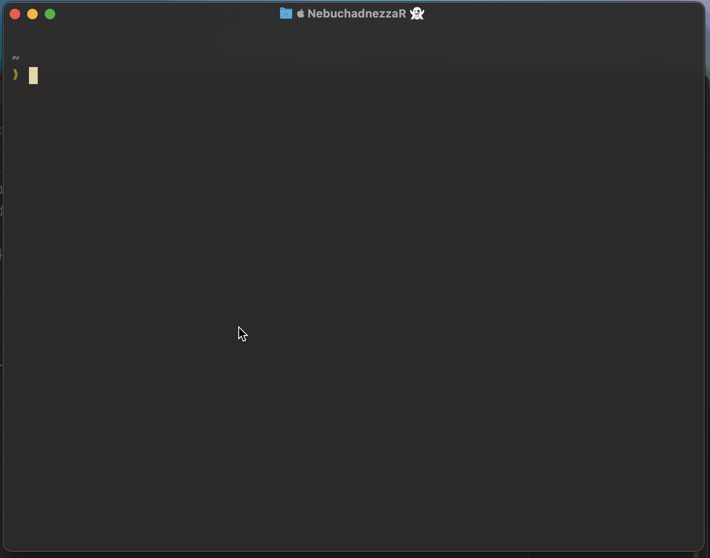
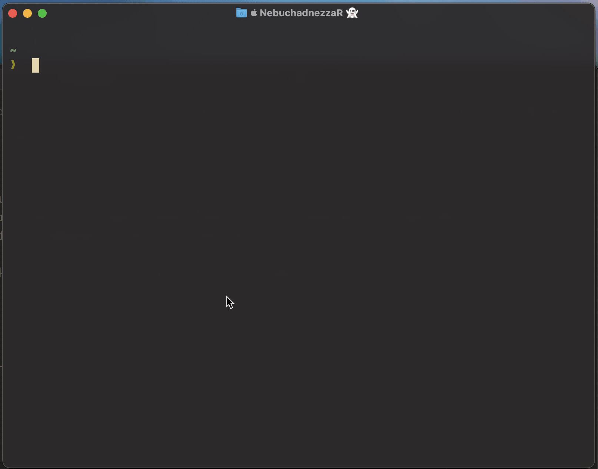

Using the terminal today is almost essential, especially if you want to be fast and
efficient when it comes to using your computer and executing commands. Wherever
possible, I like to keep my tooling simple and effective so I can focus on the task at
hand.

My current shell of choice is ZSH (specifically; oh-my-zsh), which is
highly customizable and extensible. There are many plugins available that can
enhance your ZSH experience and boost your productivity and here are some useful ZSH
plugins that I find help maximize my terminal experience for not a lot of effort.

I am aware there are many other shells and plugins and would really like to try something
like Fish, but I'm too busy with other priorities right now. With that out the way,
here are some of my favorite ZSH plugins that I believe offer a lot of value for minimal
amount of effort and configuration.

## Git

Comes by default with oh-my-zsh, it's a really great default! This plugin provides a
set of aliases and functions for working with Git. It simplifies many common Git
commands and makes it easier to work with Git repositories directly from the terminal.
For example, instead of typing `git status`, you can simply type `gst`. Here are
some other examples of the aliases provided by the Git plugin:

```zsh
# Examples!
gst # git status
gaa # git add all
gc -m "foo!" # git commit with message
```

Like many tools I often find a good way to learn is to _need_ it. What I mean by this
is if you are aware of a tool, install it and try some of the "porcelain" commands
like `gst`, `ga`, `gc`, etc. and then try to expand on the commands as and when you need
them. Initially this will absolutely slow you down, but it's a compound investment
that means you'll get that time back and learn more about the tool. Sure, it's
possibly a slower way to use it in order to learn it, but I find I get more out of
it and learn better when I actually need something, rather than reading the docs and
trying to remember and recall everything. I've wasted many hours in the past reading
_all_ the commands etc only to need to go look them up again once I've come to need it,
so save that initial effort and use the high level stuff and look the others up
as you need to.

You can also find a full list of aliases in the
[oh-my-zsh Git Cheat Sheet](https://kapeli.com/cheat_sheets/Oh-My-Zsh_Git.docset/Contents/Resources/Documents/index).

## ZSH Autosuggestions

[ZSH Autosuggestions](https://github.com/zsh-users/zsh-autosuggestions) does what it says on the tin.
It suggests commands as you type based on your command history and completions. This can
significantly speed up your workflow by reducing the amount of typing you need to do!

To complete, simply press the right arrow key to accept the suggestion, or continue
typing to ignore it.

## ZSH Syntax Highlighting

[ZSH Syntax Highlighting](https://github.com/zsh-users/zsh-syntax-highlighting)
provides syntax highlighting for your command line input, making it easier to spot
errors and understand the structure of your commands. It highlights commands as you
type, which can help you catch mistakes before you run them.

For example, if you type a valid command, it will be highlighted in green, while an
invalid command will be highlighted in red. This visual feedback can help you avoid
common mistakes and improve your command line experience.


## Atuin

Your command history is a valuable resource, [Atuin](https://github.com/atuinsh/atuin)
is a tool that helps you manage that history. Think of it as a better version of
the default history when you use `control + r`. It provides a rich featureset that
allows you to search, filter, and replay your command history, making it easier
to find and reuse commands you've run in the past. I was pretty good at using the
stock history, hitting `control + r` multiple times and searching for commands, but
Atuin has changed the way I use it and I find it much more useful.



Atuin works by storing your command history in a SQLite database, which can be synced
across devices using a cloud storage provider like Dropbox or Google Drive, but
this is a purely optional feature.

It's very eash to configure, simply create a file at `~/.config/atuin/config.toml`
and you are off and running. Some config options I really like include:

```toml
filter_mode_shell_up_key_binding = "directory"
```

This one means when I use the up arrow key, it will filter the history
by the current directory, which is super useful when you are working in a specific
directory and want to find commands related to that directory.

A bunch of things I like to filter out of my history include:

```toml
history_filter = [
   "^secret-cmd",
   "^innocuous-cmd .*--secret=.+",
   "^ls",
   "^cd",
   "^j ",
   "^git ",
   "^clear$",
   "^exit$",
   "^cl$",
]
```

An important point to note is that after you've chosen to remove something,
you'll need to run `atuin history prune` to remove them from the SQLite database.

This is so I don't see tons of entries of commands I don't care about, like
`ls`, `cd`, `clear`, etc.

You can either press `tab` from the list to add an entry to then adjust or run
it, or you can press `enter` to run the command directly. I find this
super useful when I want to run a command I used before, but I want to adjust it.



Another cool trick I leared is if you accidentally run a failing command, you can
remove it from your history. With an entry from search highlighted, you can
press `control + a` followed by `d`. You don't have to do this, but I get ocd
at times with things on my system so I personally like this one.

And that's it for my current favorite ZSH plugins and tools,
I hope you find this useful or inspiring to visit your own tooling too!
